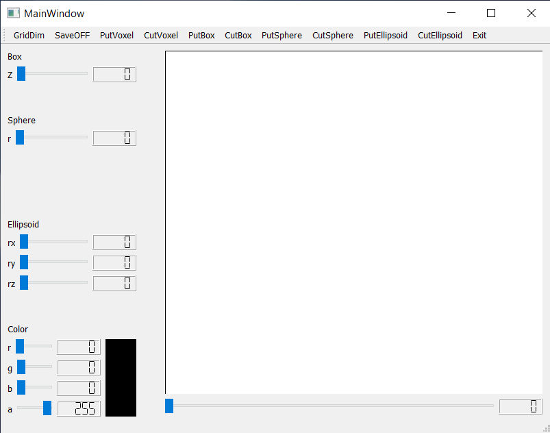
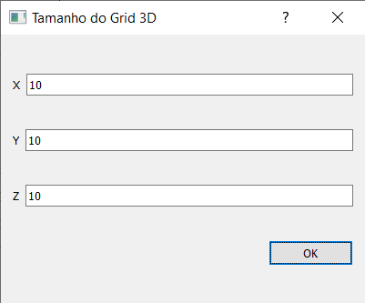
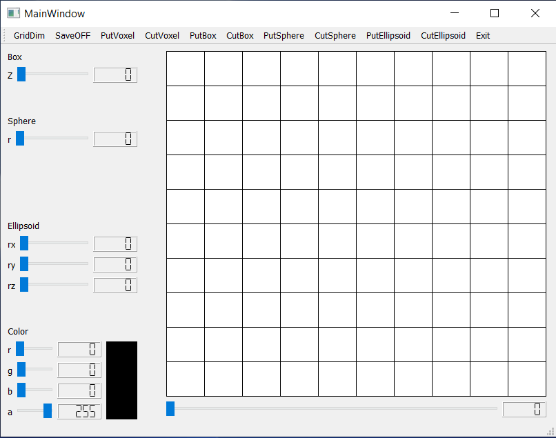
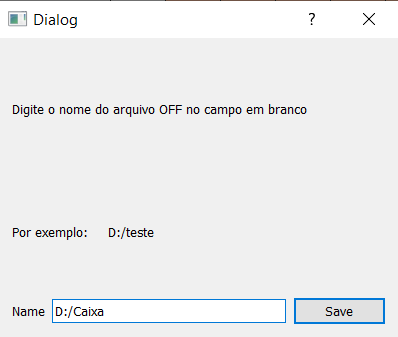
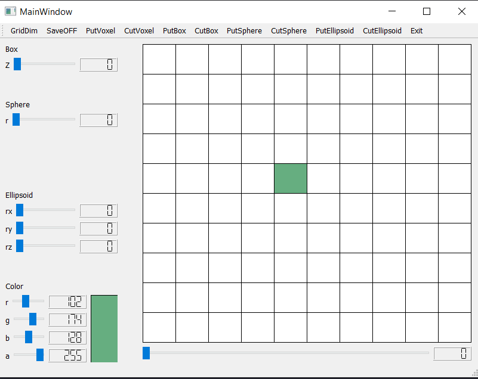
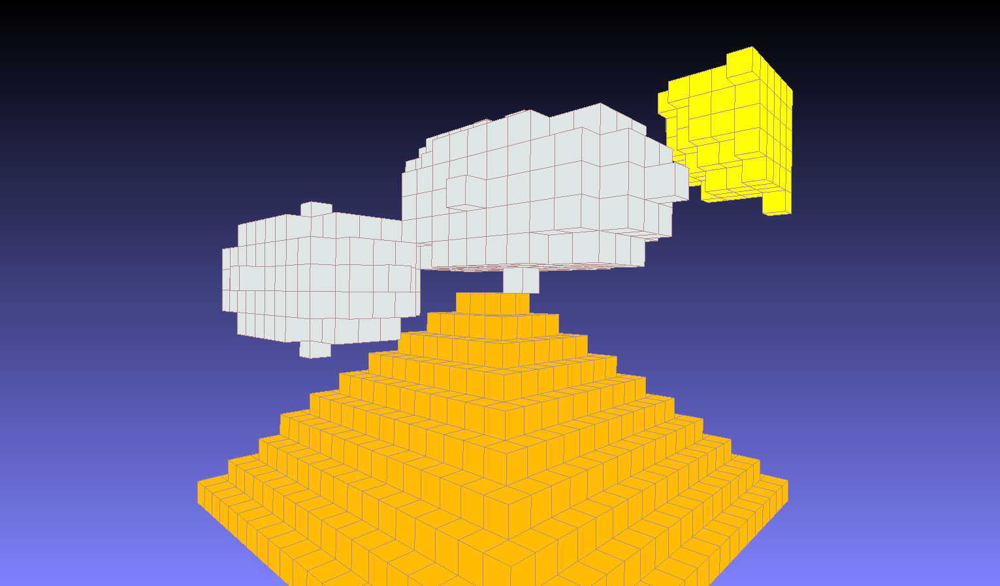

# Escultor3D - Parte 3

A interface gráfica do programa

O menu é composto por 11 botões que possui as seguintes funcionalidades

* `*GridDim*` Dimensiona o Grid de desenho.

Após definimos as dimensões, obtemos:

* `*SaveOFF*` Salva o desenho num arquivo `.OFF`. que poderá ser lido pelo programa `MeshLab`.

* `*PutVoxel*` Desenha um Voxel no Grid.

* `*CutVoxel*` Apaga um Voxel no Grid.
* `*PutBox*` Desenha uma Caixa no Grid. Mova a barra deslizante `Box` para definir o valor de `z` (profundidade) da Caixa, é importante lembrar que na posição 0 a profundidade será nula e nada será desenhado.

* `*CutBox*` Apaga uma Caixa no Grid. Mova a barra deslizante `Box` para definir o valor de `z` (profundidade) da Caixa, é importante lembrar que na posição 0 a profundidade será nula e nada será apagado.
* `*PutSphere*` Desenha uma Esfera no Grid. Mova a barra deslizante `Sphere` para definir o valor de `r` (raio) da esfera.
* `*CutSphere*` Apaga uma Esfera no Grid. Mova a barra deslizante `Sphere` para definir o valor de `r` (raio) da esfera.
* `*PutEllipsoid*` Desenha um Elipsoide no Grid. Mova a barra deslizante `Ellipsoid` para definir os valores dos semieixos `x`, `y` e `z` do Elipsoide.
* `*CutEllipsoid*` Apaga um Elipsoide no Grid. Mova a barra deslizante `Ellipsoid` para definir os valores dos semieixos `x`, `y` e `z` do Elipsoide.
* `*Exit*` Fecha o programa.

A seguinte imagem foi construída utilizando o programa.

